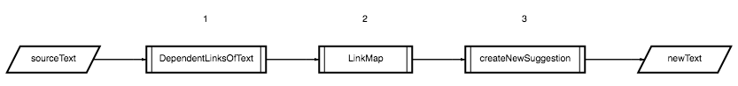

# Генерация тексте при помощи цепей маркова
## Содержание
1. [Как работает?](#Как-работает?)
2. [Где читал теорию?](#Где-читал-теорию?)

## Как работает?
Главная функция - _createNewText_ - принимает:
1. Исходный текст для генерации нового текста
2. Количество предложений
3. Максимальное количество слов в предложении

На выходе получаем новый, бесмысленный текст, сгенерируемый при помощи цепец Маркова.

### Жизненный цикл исходного текста


1. Текст разбивается на массив строк
2. Создаются два cущности со следующими типами:
    ```ts
    //  количество слов в исходном тексте
    type CounterMap = {
        [key: string]: number
    }

    // пары предыдущее слово - текущее слово
    type PairMap = {
        [key: string]: string[];
    }
    ```

    На их основе метод  _.get(link: string)_ экземпляра класса _LinkMap_ по запрашиваемому _link_ вернет массив слов с их вероятностью встречи в тексте
3.  Генерация текста на основе рандомного первого слова и слов, 
    полученных на основе предыдущего слова, учитывая вероятность их встречи в тексте

## Где читал теорию?
1. [Код. Журнал Яндекс Практикума](https://thecode.media/markov-chain/)
